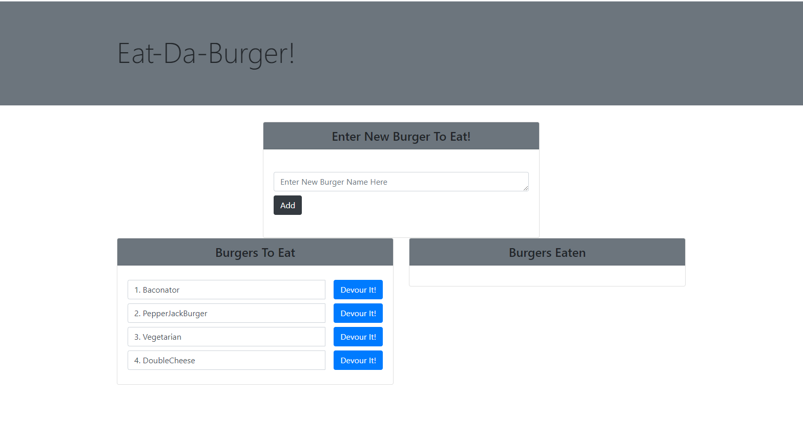

# 13_MVC

## License
   
  

  ## Description

This is an application that utilized a Model View Controller to display a burger app to the user. You can add burgers to be eaten to the page and upon clicking the devour button. The burgers are then devoured and shown to the user that they have been devoured.

  ## Link

  Heroku: https://glacial-sea-01123.herokuapp.com/

  ## Images

 ## Questions

 [github.com/sethglenn](https://github.com/sethglenn)

 Contact me at my github profile above for any inquiries you may have.